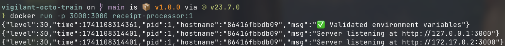
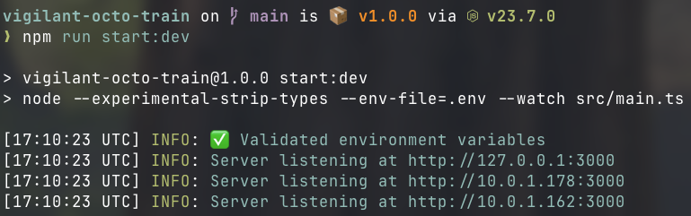
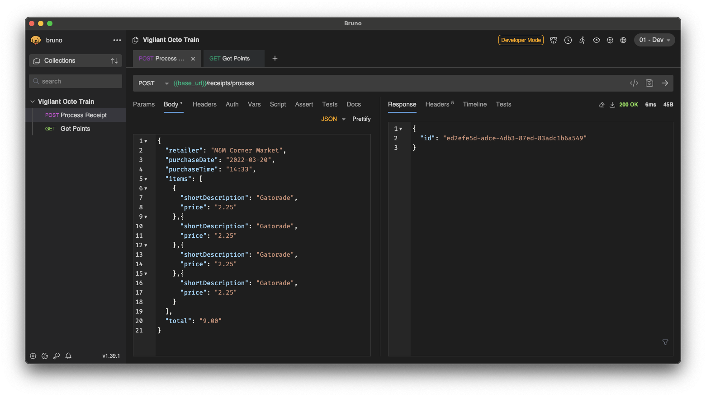

# Receipt processor service

The receipt processor service processes receipts to calculate point rewards.

## Endpoints

### `POST /receipts/process`

Processes a provided receipt, calculating the point rewards, and storing both
the receipt data and the calculated points for retrieval via the other
endpoints.

```typescript
interface Body {
  retailer: string;
  purchaseDate: string; // Validation: `yyyy-MM-dd`
  purchaseTime: string; // Validation: `HH:mm`
  total: string; // Validation: Number with two decimals: 0.00, 1.00, 999.99
  items: Array<{
    shortDescription: string;
    price: string; // Validation: Number with two decimals: 0.00, 1.00, 999.99
  }>;
}
```

### `GET /receipts/:id/points`

Returns the stored points for the receipt specified by the provided UUID.

## Running the service

### Docker

If you have Docker installed, you can build and run with these commands:

```
docker build . -t receipt-processor:1
docker run -p 3000:3000 receipt-processor:1
```



### On bare metal

If you have Node.js v22.6+ installed, you can set up and run with these commands:

```shell
npm ci
npm run start:dev
```



## Tests

This repository comes with suites of unit and integration tests.

### Unit tests

Unit tests can be run by running `npm run test:unit`.

### Integration tests

Integration tests can be run by running `npm run test:integration` after
starting a server either on bare metal or in Docker.

## Continuous integration (CI)

CI is configured to run through Github Workflows. The workflows run formatting
checks, linter checks, unit tests, and integration tests.

The CI runs can be found [on Github under the Actions tab][gh-actions].

## API client collection

The `bruno/` directory contains an API client collection usable with [Bruno][bruno].



## Platform choices

- ESM to use modern standards
- TypeScript with type stripping for dramatically simplified TypeScript building
  - Requires Node 22.6+ and TS 5.8+
- Fastify for modern and performant HTTP server implementation
- `node:test` for low configuration testing
- Zod for fast and ergonomic validation

[gh-actions]: https://github.com/keawade/vigilant-octo-train/actions
[bruno]: https://www.usebruno.com/
